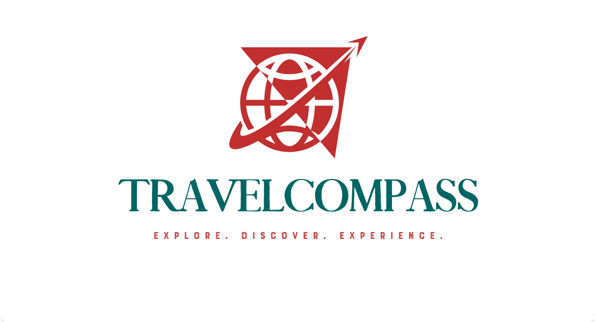

  <h1>
     TravelCompass 
    🧭 - Your Guide to Extraordinary Adventures 
  </h1>

## Overview

TravelCompass is an innovative platform that empowers adventure seekers to discover and book unique experiences offered by tour operators, hiking guides, and other adventure providers. We aggregate a wide range of curated adventures from across the globe, making it easy for travelers to find their perfect journey and book directly. 

## Key Features

* **Adventure Listings:** Showcase diverse adventure experiences with detailed descriptions, photos, itineraries, pricing, and availability.
* **Search & Filtering:** Robust search and filtering capabilities to find adventures based on location, activity type, duration, difficulty, and more.
* **Seamless Booking:** Intuitive booking process with secure payment integration.
* **User Profiles:**  Create profiles, save favorite adventures, and track bookings.
* **Reviews & Ratings:** Leave reviews and ratings for completed adventures.
* **Provider Profiles:** Adventure providers showcase offerings, manage bookings, and communicate with travelers.

## Technologies Used

* **Front-end:** React.js, HTML5, CSS3
* **Back-end:** Node.js, Express.js
* **Database:** MongoDB
* **Payment Processing:** Stripe
* **Mapping:** Google Maps API
* **Image Hosting:** Cloudinary
* **Cloud Hosting:** [Your Choice - e.g., AWS, Heroku]
* **Version Control:** Git

## Getting Started

1. **Clone the repository:** `git clone https://github.com/your-username/TravelCompass.git`
2. **Install dependencies:** `npm install` (in both root and client directories if applicable)
3. **Set up environment variables:** Create a `.env` file based on the `.env.example`
4. **Start the development server:** `npm run dev` (or appropriate command based on your setup)

## Contributing

We welcome contributions! Please read our [CONTRIBUTING.md](CONTRIBUTING.md) for guidelines.

## License

This project is licensed under the [MIT License](LICENSE).

## Contact

* **Project Maintainer:** [Your Name/Team Name]
* **Email:** [Your Email]

**Let's empower travelers to embark on extraordinary adventures!** 🚀
