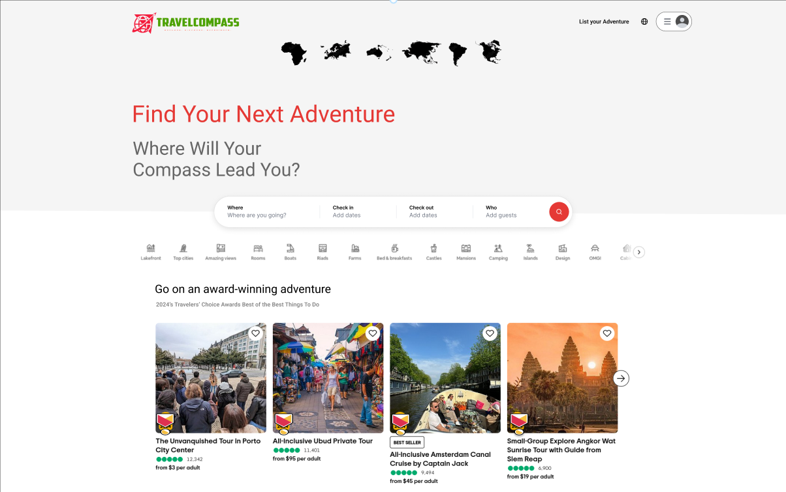

<h1 align="left">
<strong>TravelCompass </strong>
 
</h1>

**Unleash Your Wanderlust**

---

## **The Adventure Awaits**

The world is brimming with extraordinary experiences, but finding and booking them can be a daunting task. Travelers are overwhelmed by scattered information and limited options, while adventure providers struggle to reach a wider audience.

## **Introducing TravelCompass**

TravelCompass is your gateway to unforgettable adventures. We're a curated marketplace connecting passionate travelers with unique experiences from around the globe.

* **For Travelers:** Discover hidden gems, compare options, and book seamlessly.
* **For Providers:** Showcase your offerings, manage bookings, and grow your business.

## **Key Features that Set Us Apart**

* **Curated Collection:** Handpicked adventures, ensuring quality and authenticity.
* **Personalized Recommendations:** AI-powered suggestions based on your interests and preferences.
* **Seamless Booking:** Effortless booking and secure payment processing.
* **Interactive Maps:** Explore destinations and plan your itinerary with ease.
* **Vibrant Community:** Connect with fellow travelers and share your stories.

## **Technology that Powers the Adventure**

* **Cutting-Edge Front-end:** React.js for a smooth, interactive user experience.
* **Robust Back-end:** Node.js and Express.js for reliable performance and scalability.
* **Flexible Database:** MongoDB for efficient data management.
* **Secure Payments:** Stripe integration for worry-free transactions.
* **Location Intelligence:** Google Maps API for immersive exploration.

## **The Author Behind the Compass**

* **OGHAZI** - A passionate adventurer, tech enthusiast, and human centric developer dedicated to making your travel dreams a reality.

## **The Untapped Potential**

* The global adventure tourism market is valued at approximately $550 billion and is projected to grow at a CAGR of 15-17% in the coming years.
* TravelCompass is poised to capture this market by providing a user-centric platform that simplifies the discovery and booking process.

## **Join the Adventure**

* **Investors:** We're seeking  seed funding to accelerate our growth and expand our reach.
* **Adventure Providers:** Partner with us and unlock a world of opportunities.
* **Travelers:** Sign up for early access and embark on your next extraordinary journey.

**Let's navigate the world of adventure, together.**

---